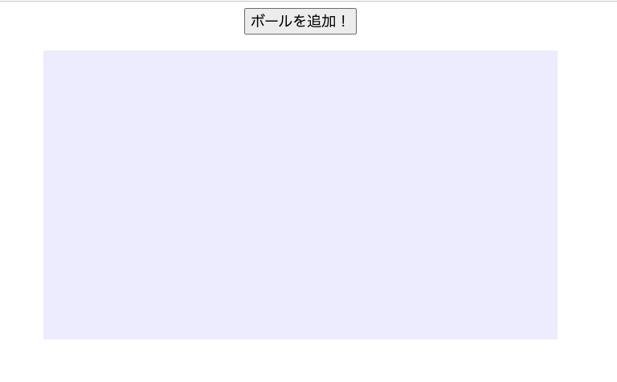

# **01_レイアウトをつくろう**



## **HTMLの説明**

まずはゲームを表示する枠をHTMLで作ります

```html

<!DOCTYPE html>
<html lang="ja">

    <head>
    <meta charset="UTF-8">
    <title>バウンドボール</title>
    
    </head>

    <body>

        <button id="addBallBtn">ボールを追加！</button>
        <canvas id="game" width="640" height="360"></canvas>

    </body>

</html>

```

HTMLはWebサイトの土台を作る言語です  
これだけだと、ボタンだけが表示されているだけで枠が作られていません  

## **CSSの説明**

CSSを使って画面の配置やデザインしていきます

```css

    canvas {
      background: #eef;     /*背景色を指定*/
      display: block;       /*箱の形式する*/
      margin: 20px auto;    /*左右に余白をつけて真ん中にする*/
    }

    #addBallBtn {
      display: block;       /*箱の形式する*/
      margin: auto;         /*左右に余白をつけて真ん中にする*/
      font-size: 18px;      /*文字のサイズを指定*/
    }

```