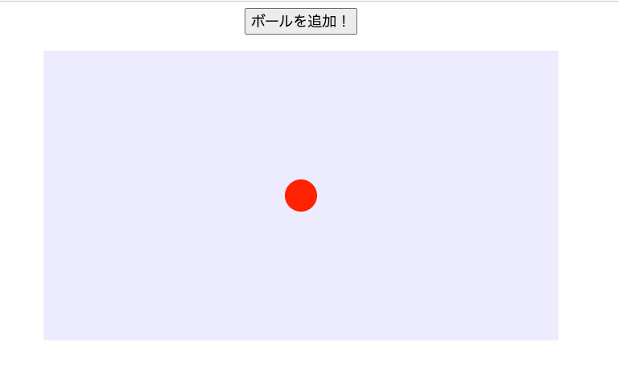

# **02_ボールを表示する**



## **①javaScriptとは**

HTMLやCSSをリアルタイムに操作することができる言語  
javaScriptを書く場所を作る

```html

<!DOCTYPE html>
<html lang="ja">

    <head>
    <meta charset="UTF-8">
    <title>バウンドボール</title>
    
    </head>

    <body>

        <button id="addBallBtn">ボールを追加！</button>
        <canvas id="game" width="640" height="360"></canvas>

        <!-- ここに追加 -->
        <script>
          // ゲームフィールドを使うよ
          const canvas = document.getElementById('game');
          // ２Dのアニメーションだよ
          const ctx = canvas.getContext('2d');

          // ボールの情報
          let x = 320; // 横の位置
          let y = 180;  // 縦の位置
          let radius = 20; //半径

          // 描画
          ctx.beginPath();
          ctx.arc(x, y, radius, 0, Math.PI * 2);
          ctx.fillStyle = 'red';
          ctx.fill();

        </script>

    </body>

</html>

```

## **②ボタンが押されたら表示**

ボタンが押されたらボールが表示されるようにする  
条件を追加

```html

<script>
    // ゲームフィールドを使うよ
    const canvas = document.getElementById('game');
    // ２Dのアニメーションだよ
    const ctx = canvas.getContext('2d');

    let x = 320;　
    let y = 180;
    let radius = 20;

    //⭐️addBallBtnをクリックしたら
    document.getElementById('addBallBtn').addEventListener('click', function () {
      ctx.beginPath();
      ctx.arc(x, y, radius, 0, Math.PI * 2);
      ctx.fillStyle = 'red';
      ctx.fill();
    });

</script>

```