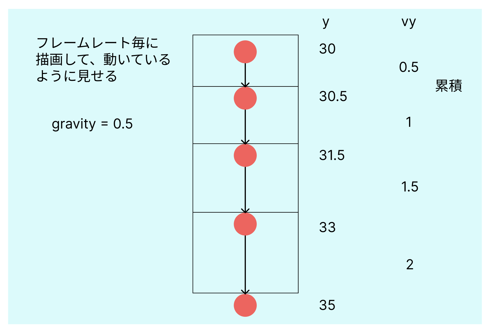

# **03_ボールを動かす**



## **①フレームレート毎に動かす**

フレームで動いていることを確認してみる  

```html

      <script>
        // ゲームフィールドを使うよ
        const canvas = document.getElementById('game');
        // ２Dのアニメーションだよ
        const ctx = canvas.getContext('2d');

        let x = 320;
        let y = 30;         // ⭐️上の方から落とす
        let radius = 20;
        let vy = 0;         // ⭐️落下スピード
        let gravity = 0.5;  // ⭐️重力

        document.getElementById('addBallBtn').addEventListener('click', function () {
          ctx.beginPath();
          ctx.arc(x, y, radius, 0, Math.PI * 2);
          ctx.fillStyle = 'red';
          ctx.fill();
        });

        // ⭐️フレーム毎に繰り返す
        function loop(){
          console.log('1フレーム実行');
          requestAnimationFrame(loop);
        }

        loop();

      </script>


```

## **②loopの中で描画**


```html

<script>
    // ゲームフィールドを使うよ
    const canvas = document.getElementById('game');
    // ２Dのアニメーションだよ
    const ctx = canvas.getContext('2d');

    let x = 320;
    let y = 30;         // 上の方から落とす
    let radius = 20;
    let vy = 0;         // 落下スピード
    let gravity = 0.3;  // 重力

    document.getElementById('addBallBtn').addEventListener('click', function () {
      
    });

    function loop(){
      
      // ⭐️フレーム毎にフィールドクリア
      ctx.clearRect(0, 0, canvas.width, canvas.height);

      vy += gravity; // ⭐️だんだん速く
      y += vy;       // ⭐️下に動かす

      // ⭐️地面（canvasの下）についたら止める
      if (y + radius > canvas.height) {
        y = canvas.height - radius;
        vy = 0;
        isFalling = false;
      }

      //⭐️loopの中に移動
      ctx.beginPath();
      ctx.arc(x, y, radius, 0, Math.PI * 2);
      ctx.fillStyle = 'red';
      ctx.fill();

      requestAnimationFrame(loop);
    }

    loop();

</script>

```

## **③ボタン押したら落ちるようにする**

```html

<script>
    // ゲームフィールドを使うよ
    const canvas = document.getElementById('game');
    // ２Dのアニメーションだよ
    const ctx = canvas.getContext('2d');


    let x = 320;
    let y = 30;         // 上の方から落とす
    let radius = 20;
    let vy = 0;         // 落下スピード
    let gravity = 0.3;  // 重力

    let isFalling = false;   //⭐️ボールを落とすかどうか判定最初はスイッチを入れない

    document.getElementById('addBallBtn').addEventListener('click', function () {
      //⭐️ボタンが押されたら最初に戻る
      y = 30;
      vy = 0;
      //⭐️動かしていいよスイッチを入れる
      isFalling = true;
    });

    function loop() {
      // フレーム毎にフィールドクリア
      ctx.clearRect(0, 0, canvas.width, canvas.height);

      //⭐️スイッチが入っている時だけ落とす
      if(isFalling){
        vy += gravity; // だんだん速く
        y += vy;       // 下に動かす

        // 地面（canvasの下）についたら止める
        if (y + radius > canvas.height) {
          y = canvas.height - radius;
          vy = 0;
          // ⭐️下に着いたらスイッチオフ
          isFalling = false;
        }
      }

      ctx.beginPath();
      ctx.arc(x, y, radius, 0, Math.PI * 2);
      ctx.fillStyle = 'red';
      ctx.fill();

      requestAnimationFrame(loop);
    }

    loop();
  </script>

```