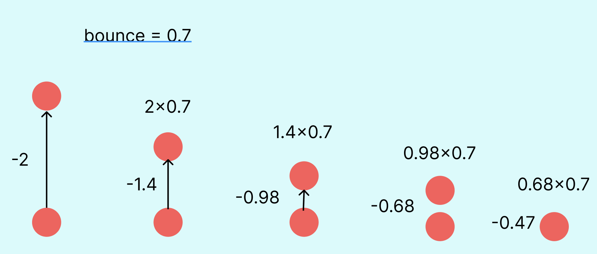

# **04_ボールをバウンドさせる**



## **①下に着いたら跳ね返る**

フレームで動いていることを確認してみる  

```html

      <script>
    // ゲームフィールドを使うよ
    const canvas = document.getElementById('game');
    // ２Dのアニメーションだよ
    const ctx = canvas.getContext('2d');


    let x = 320;
    let y = 30;         // 上の方から落とす
    let radius = 20;
    let vy = 0;         // 落下スピード
    let gravity = 0.3;  // 重力

    let isFalling = false;   //ボールを落とすかどうか判定最初はスイッチを入れない

    let bounce = 0.7; //⭐️バウンドの大きさ

    document.getElementById('addBallBtn').addEventListener('click', function () {
      //ボタンが押されたら最初に戻る
      y = 30;
      vy = 0;
      //動かしていいよスイッチを入れる
      isFalling = true;
    });

    function loop() {
      // フレーム毎にフィールドクリア
      ctx.clearRect(0, 0, canvas.width, canvas.height);

      //スイッチが入っている時だけ落とす
      if(isFalling){
        vy += gravity; // だんだん速く
        y += vy;       // 下に動かす

        // 地面（canvasの下）についたら止める
        if (y + radius > canvas.height) {
          y = canvas.height - radius;
          //⭐️上方向に移動スピードを変える
          vy *= -bounce;
          
          // ⭐️ 小さくなったら止める（微振動防止）
          if (Math.abs(vy) < 0.5) {
            vy = 0;
            isFalling = false;
          }
        }
      }

      ctx.beginPath();
      ctx.arc(x, y, radius, 0, Math.PI * 2);
      ctx.fillStyle = 'red';
      ctx.fill();

      requestAnimationFrame(loop);
    }

    loop();
  </script>

```

## **②横にも移動する**

```html

<script>
    const canvas = document.getElementById('game');
    const ctx = canvas.getContext('2d');

    let x = 320;
    let y = 30;
    let radius = 20;

    let vy = 0;         // 縦の速度
    let vx = 3;         // ⭐️ 横の速度

    let gravity = 0.3;
    let bounce = 0.7;
    let friction = 0.98;  // ⭐️ 摩擦（だんだん転がりが減る）

    let isFalling = false;

    document.getElementById('addBallBtn').addEventListener('click', function () {
      x = 320;
      y = 30;
      vy = 0;
      vx = (Math.random() - 0.5) * 6; // ⭐️ 横方向ランダム
      isFalling = true;
    });

    function loop() {
      ctx.clearRect(0, 0, canvas.width, canvas.height);

      if (isFalling) {
        vy += gravity;
        y += vy;
        x += vx;// ⭐️

        // 下に当たったらバウンド
        if (y + radius > canvas.height) {
          y = canvas.height - radius;
          vy *= -bounce;

          // ⭐️横方向も摩擦で減速
          vx *= friction;

          // ⭐️小さくなったら止める
          if (Math.abs(vy) < 0.5 && Math.abs(vx) < 0.5) {
            vy = 0;
            vx = 0;
            isFalling = false;
          }
        }

        // ⭐️ 左右に当たったら反転
        if (x - radius < 0) {
          x = radius;
          vx *= -bounce;
        }
        if (x + radius > canvas.width) {
          x = canvas.width - radius;
          vx *= -bounce;
        }
      }

      ctx.beginPath();
      ctx.arc(x, y, radius, 0, Math.PI * 2);
      ctx.fillStyle = 'red';
      ctx.fill();

      requestAnimationFrame(loop);
    }

    loop();
  </script>

```
