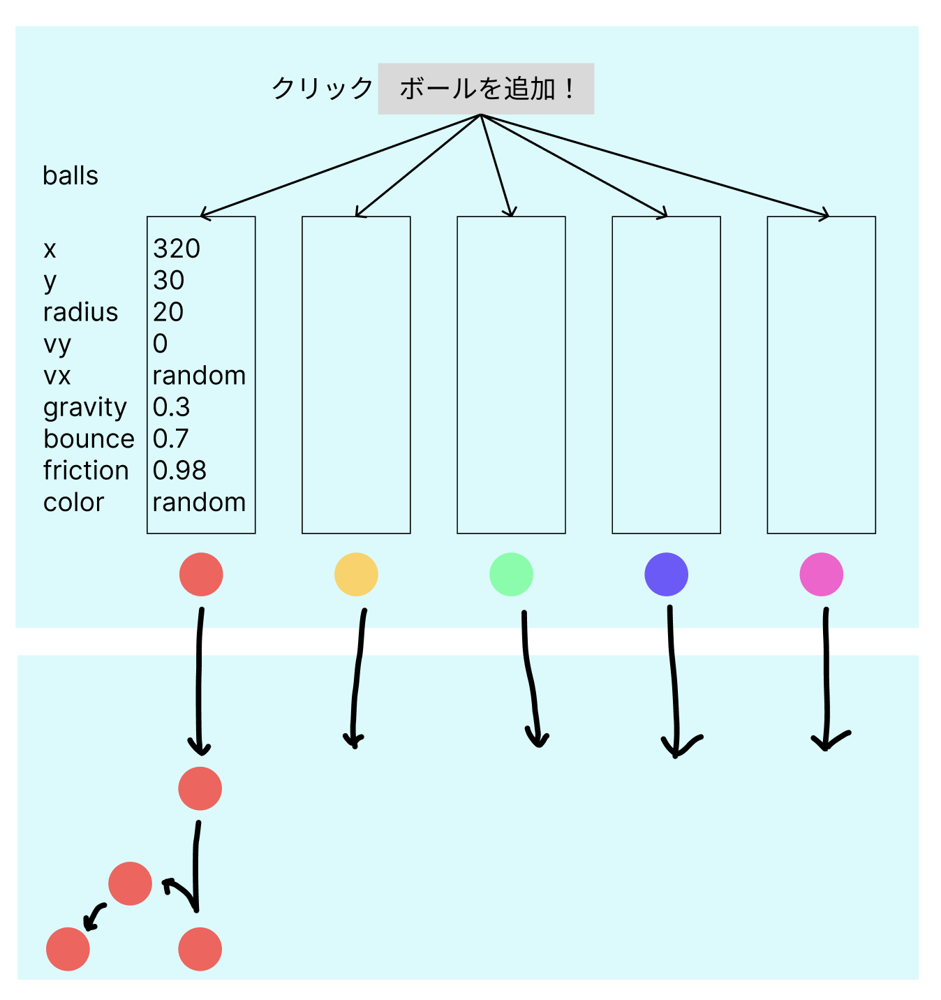

# **05_複数のボールを出す**



## **①ボールの情報を配列で管理**

フレームで動いていることを確認してみる  

```html

      <script>
    // ゲームフィールドを使うよ
    const canvas = document.getElementById('game');
    // ２Dのアニメーションだよ
    const ctx = canvas.getContext('2d');

    // ⭐️ ボールを全部ここに入れていく
    const balls = [];

    // ⭐️ ボールを作る関数
    function createBall() {
      return {
        x: 320,
        y: 30,
        radius: 20,
        vy: 0,
        vx: (Math.random() - 0.5) * 6,
        gravity: 0.3,
        bounce: 0.7,
        friction: 0.98,
        color: `hsl(${Math.random() * 360}, 80%, 60%)`
      };
    }

    // ⭐️ ボタンで追加
    document.getElementById('addBallBtn').addEventListener('click', () => {
      const ball = createBall();
      balls.push(ball);
    });

    // ⭐️ アニメーションループ
    function loop() {
      ctx.clearRect(0, 0, canvas.width, canvas.height);

      //⭐️一つずつボールのデータを取ってきて
      balls.forEach(ball => {
        updateBall(ball); //ボールの位置を変える
        drawBall(ball);   //ボールを描画する
      });

      requestAnimationFrame(loop);
    }

    loop();
  </script>

```

## **②updateBall関数とdrawBall関数**

```html

<script>
    const canvas = document.getElementById('game');
    const ctx = canvas.getContext('2d');

    // ボールを全部ここに入れていく
    const balls = [];

    // ボールを作る関数
    function createBall() {
      return {
        x: 320,
        y: 30,
        radius: 20,
        vy: 0,
        vx: (Math.random() - 0.5) * 6,
        gravity: 0.3,
        bounce: 0.7,
        friction: 0.98,
        color: `hsl(${Math.random() * 360}, 80%, 60%)`
      };
    }

    // ⭐️ ボールの動きを更新
    function updateBall(ball) {
      ball.vy += ball.gravity;
      ball.y += ball.vy;
      ball.x += ball.vx;

      // 下にぶつかったら
      if (ball.y + ball.radius > canvas.height) {
        ball.y = canvas.height - ball.radius;
        ball.vy *= -ball.bounce;
        ball.vx *= ball.friction;

        if (Math.abs(ball.vy) < 0.5 && Math.abs(ball.vx) < 0.5) {
          ball.vy = 0;
          ball.vx = 0;
        }
      }

      // 左右にぶつかったら
      if (ball.x - ball.radius < 0) {
        ball.x = ball.radius;
        ball.vx *= -ball.bounce;
      }
      if (ball.x + ball.radius > canvas.width) {
        ball.x = canvas.width - ball.radius;
        ball.vx *= -ball.bounce;
      }
    }

    // ⭐️ 描画する関数
    function drawBall(ball) {
      ctx.beginPath();
      ctx.arc(ball.x, ball.y, ball.radius, 0, Math.PI * 2);
      ctx.fillStyle = ball.color;
      ctx.fill();
    }

    // アニメーションループ
    function loop() {
      ctx.clearRect(0, 0, canvas.width, canvas.height);

      balls.forEach(ball => {
        updateBall(ball);
        drawBall(ball);
      });

      requestAnimationFrame(loop);
    }

    // ボタンで追加
    document.getElementById('addBallBtn').addEventListener('click', () => {
      const ball = createBall();
      balls.push(ball);
    });

    loop();
  </script>

```
